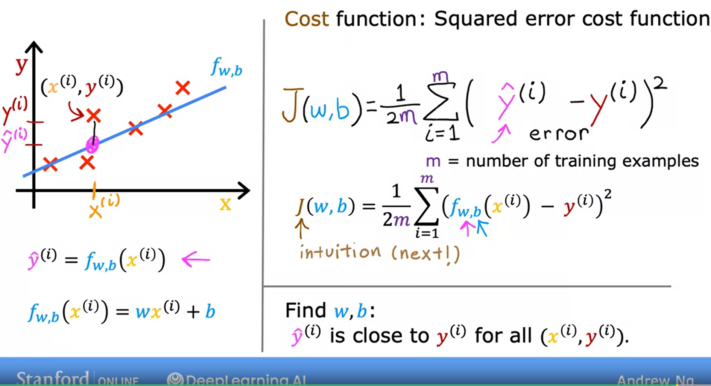

## Linear regression model
Regression model predicts a number.
Linear regression fits a straight line to your data.

x = "input" variable = feature

y = "output" variable = target variable

m = number of training examples

feature -> Model -> prediction/estimated target

## Cost function formula
Tell us how well the model is doing so that we can try to get it to do better

## Cost function intuition
How the cost function can be used to find the best parameters for your model?

The goal of linear regression is to find the parameters w or w and b that results in the smallest possible value for the cost function J.

## Visualizing the cost function
