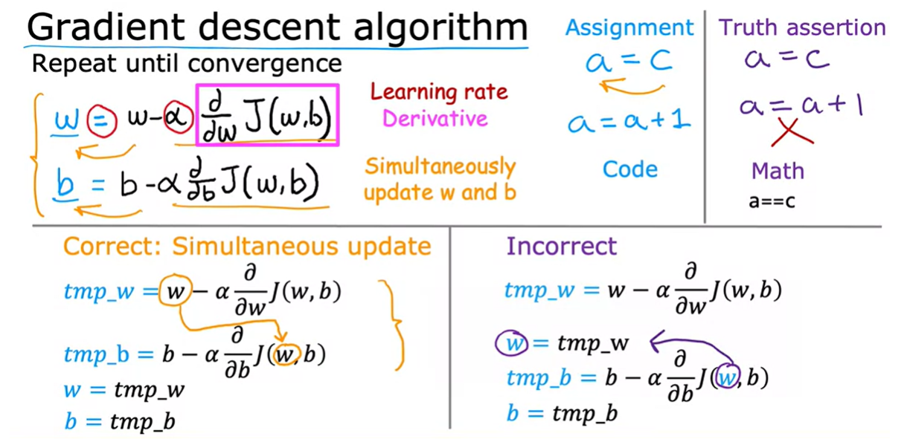
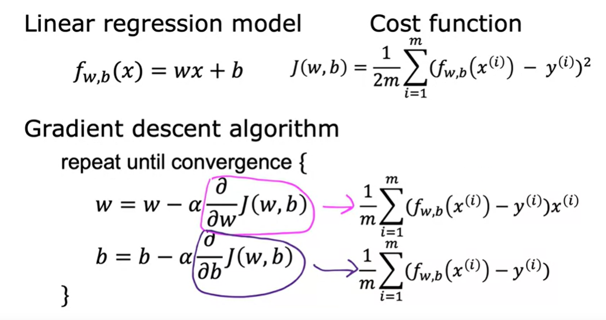

# Gradient descent
Start with w=0, b = 0
Keep changing w and b to reduce cost function J(w,b), until we settle or near a minimum.

 if you're standing at this point in the hill and you look around, you will notice that the `best direction` to take your next step downhill is roughly that direction. Mathematically, this is the direction of `steepest descent`.

 The bottoms of both the first and the second valleys are called `local minima`. The `global minimum` is the lowest point in the entire graph, even lower than the local minima. The goal of gradient descent is to find the global minimum of the cost function J.

## Implementing gradient descent

α `learning rate` between 0 to 1.  it controls how big a step we take downhill during each iteration.

d/dwJ(w,b) is the derivate term of the const function J, here the derivate is telling in which direction you want to take your baby step.
The derivative represents the rate of change of a function with respect to its independent variable 

Note!: you want to update both parameters simultaneously.

## Gradient descent intuition
The derivative at this point on the line is to draw a tangent line, which is a straight line that touches this curve at that point. 
The slope of this line is the derivative of the function j at this point. 

## Learning rate
Too small: The outcome of this process is that you do end up decreasing the cost J but incredibly slowly.

Too large: may overshoot and may never reach the minimum. may fail to converge and may even diverge.

## Gradient descent for linear regression 
- Linear regression model
- Cost function
- Gradient descent algorithm

Informally, a convex function is of bowl-shaped function and it cannot have any local minima other than the single global minimum. When you implement gradient descent on a convex function, one nice property is that so long as you're learning rate is chosen appropriately, it will always converge to the global minimum.
