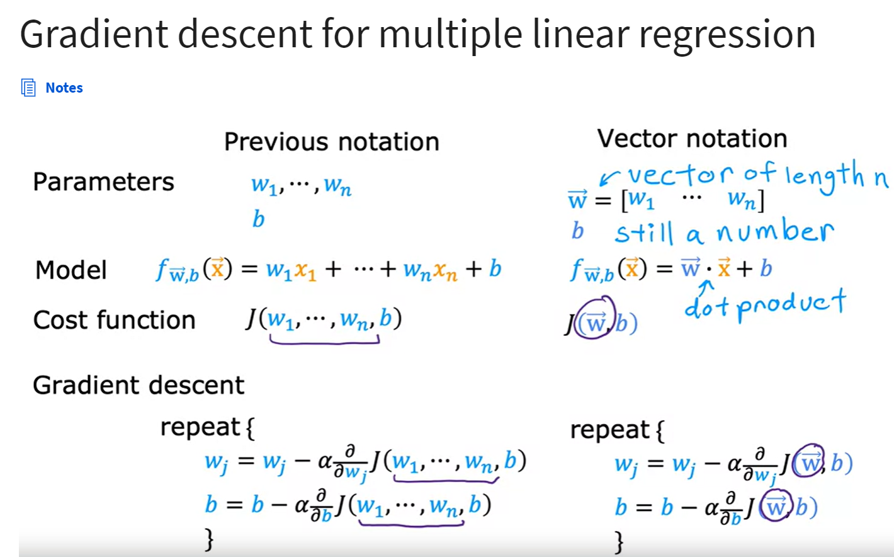

# Multiple linear regression

## Multiple features
Notions:


## Vectorization
using vectorization will both make your code shorter and also make it run much more efficiently

Sample using NumPy vectorization implementation:
```
    f = np.dot(w, x) + b

    f = w[0]*x[0] + w[1]*x[1] + w[2]*x[2] ... + b
```
The NumPy dot function is able to use parallel hardware in your computer 

Test the execution time:


## Gradient descent for multiple linear regression



## Normal equation: alternative to gradient descent
- Only for linear regression
- Solve for w, b without iteration

- Doesn't generalize to other learning algorithms.
- Slow when number of features is large(>10000)


With just a few tricks such as picking and scaling features appropriately and also choosing the learning rate alpha appropriately, you'd really make this work much better


## Checking gradient descent for convergence
find parameters close to the global minimum of the cost function

## Choosing the learning rate
