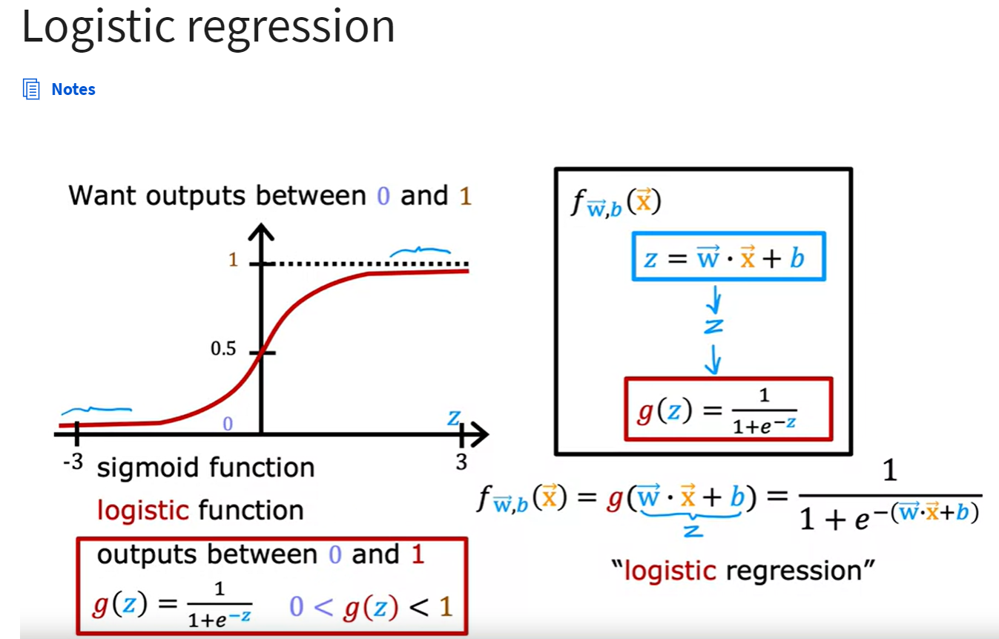

## Motivations

Learning regression often doesn't work very well for classification problems.

## Logistic regression
Sigmoid function /logistic function:

A lot of Internet advertising was actually driven by basically a slight variation of logistic regression

## Decision boundary
The line where you're just almost neutral about whether y is 0 or y is 1.
