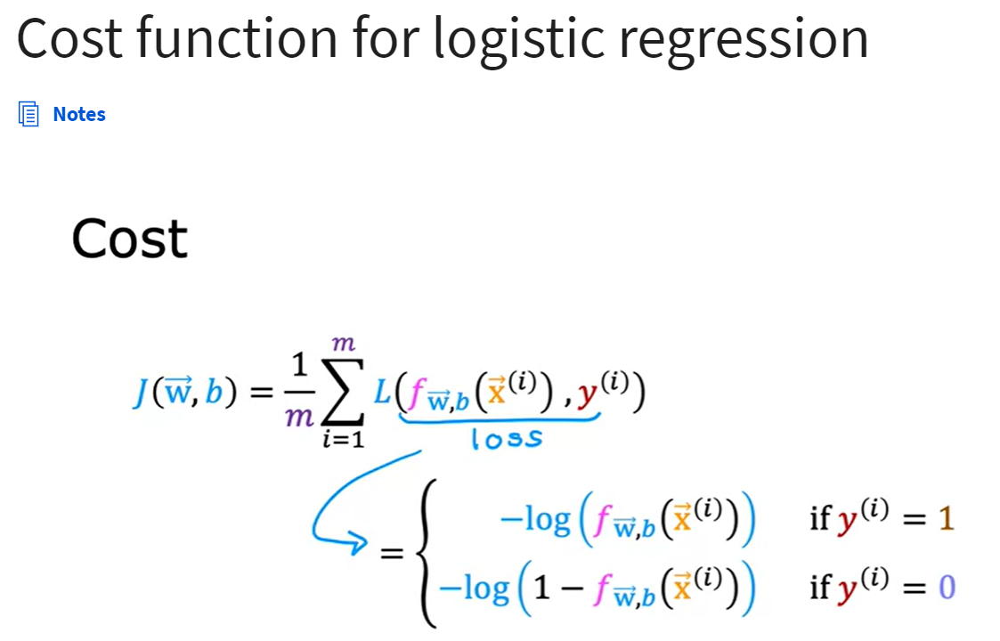

## Cost function for logistic regression

Why is the squared error cost not used in logistic regression?
The non-linear nature of the model results in a “wiggly”, non-convex cost function with many potential local minima.
If using the mean squared error for logistic regression, the cost function is "non-convex", so it's more difficult for gradient descent to find an optimal value for the parameters w and b.

## Simplified Cost Function for Logistic Regression
