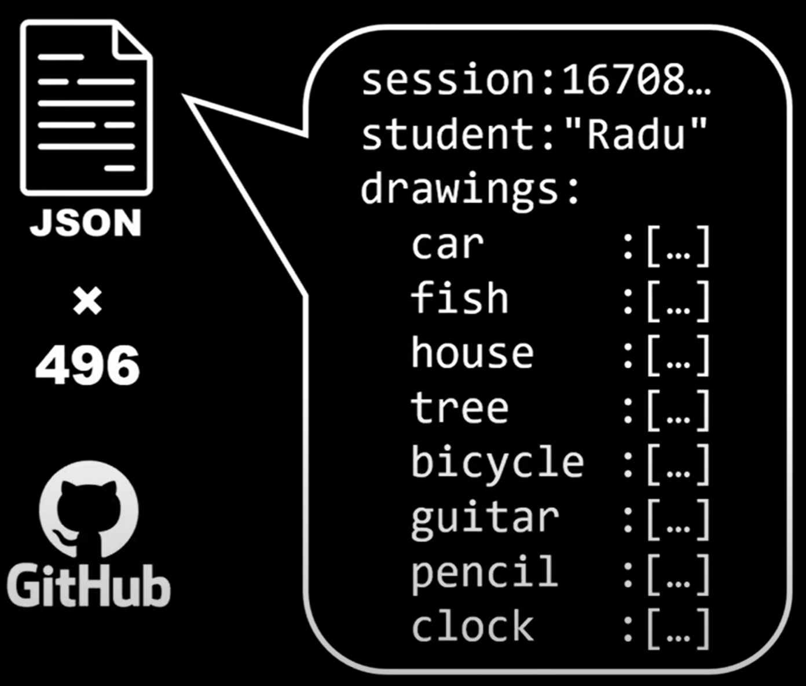

```
    mkdir data/raw
    
    mkdir dataset/img
    mkdir dataset/json

```
Copy all data into data/raw
Covert all data into dataset/img and dataset/json

```
    mkdir node
```
Create folder for nodejs project

generate samples.json
```
    [
        {"id":1,"label":"car","student_name":"Radu","student_id":1663053145814},
        ...
    ]
```

Install canvas in nodejs environment
```
    npm i canvas


    const { createCanvas } = require("canvas")
```
