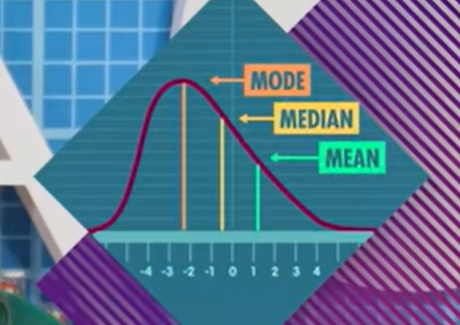

# Mean, Median, and Mode: Measures of Central Tendency

The center/middle of a bunch of data points is called the `central tendency`. 

There are three common ways to measure the central tendency: mean, median, and mode.

Normal: means a distribution of data has roughly the same number of data points on either side of the mean.

Distribution: How often each value occurs in the data set.

Mean(Average) = sum / number of items
Average can be distorted by outliers and be `deceptive`

Median: THE MIDDLE NUMBER IF WE LINED UP OUR DATA FROM SMALLEST TO LARGEST.
If the data set has an odd number of observations, the middle one is selected.
If the data set has an even number of observations, the median is the mean of the two middle values

THE FACT THAT Median == Mean TELLS US THAT THE DISTRIBUTION IS SYMMETRIC: 
THAT THERE'S EQUAL AMOUNT OF DATA ON EITHER SIDE OF THE MEDIAN, AND EQUAL AMOUNTS ON EITHER SIDE OF THE MEAN

Mode: The most common value in a data set. The value that appears most often in the data set.
THE MODE IS MOST USEFUL WHEN YOU HAVE A RELATIVELY LARGE SAMPLE SO THAT YOU HAVE A LARGE NUMBER OF THE POPULAR VALUES.
Can be used for both numerical and categorical data.

When the median != mean, the distribution is `skewed`. There a few extreme values that are distorting the mean.
When the median == mean, the distribution is symmetric.

With the skewed distribution, mode is the highest point on the distribution, median stay in the middle, but the mean will be pulled in the direction of the skew/ pulled to the unusual.

the median is a better measure of central tendency than the mean.
