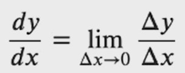

The derivative of y(denoted dy ) with respect to x (denoted dx) can be represented as:



```
# f(x + delta) - f(x) / delta
def diff_demo(my_f, my_x, my_delta):
    return (my_f(my_x + my_delta) - my_f(my_x)) / my_delta
```
