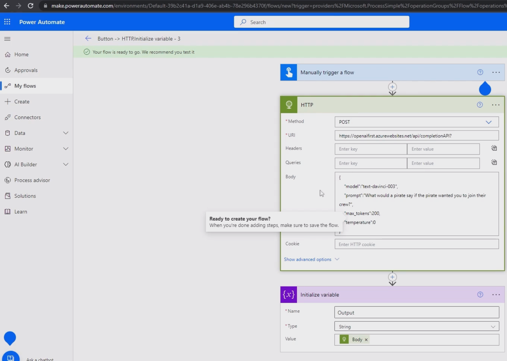
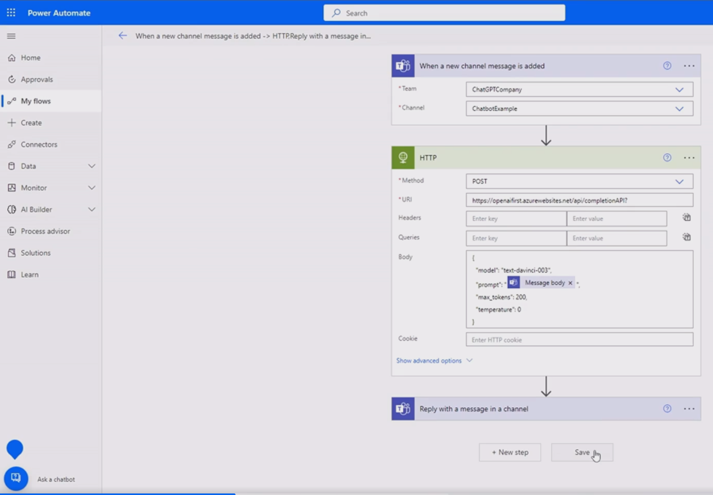

## Create a flow
https://make.powerautomate.com/environments/


body
```
{
    "model": "text-davinci-003", 
    "prompt": "give me a slogan for a cookie company", 
    "max_tokens": 200, 
    "temperature":  0
}
```



## Create Team chatbot 
create team channel 'chatbotExample'

create a flow for chat bot

