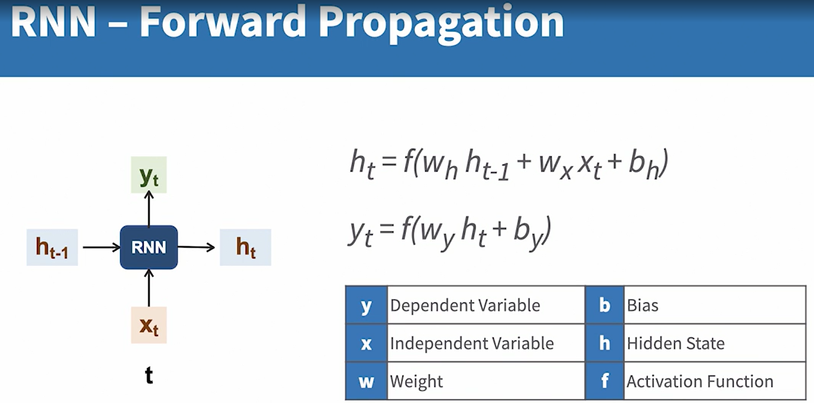

## Training Process
### Similar concepts, processes, and techniques as regular
neural networks
Data preparation
Weights initialization
Forward propagation
Loss and cost computation
Backward propagation and gradient descent

### Unique Concepts
• Training for time steps: Each time step may produce an output
• Hidden state creation and propagation: Capture prior dependencies
• Cumulative error and derivative computations

## Forward propagation with RNNs
• Multiple samples: each sample is a sequence
• Same model for each time step
    Layers, nodes, weights, biases, and activation functions
• Hidden state
    Memory from previous layers
    Additional input from previous time slice
    Additional output to next time slice

## Loss Computation
Loss for a given time step is computed based on the predicted output and the expected output for that time step.

• Uses similar loss functions like regular neural networks
• Compute loss for each time step
• Aggregate loss across time steps
• Compute cost across multiple samples

## Back Propagation
• Compute derivatives (delta) for each time step
    Hidden state
    Output
• Compute cumulative delta
• Apply cumulative delta to weights and biases
• Continue gradient descent until error is minimized

## Predicting Next Time Step
• Inputs/Outputs vary based on the type of model
    Input = previous time step/sequences
    Output = next time step/sequence
• Prepare input data using same steps as training
• Feed into the RNN Model to produce output(s)
