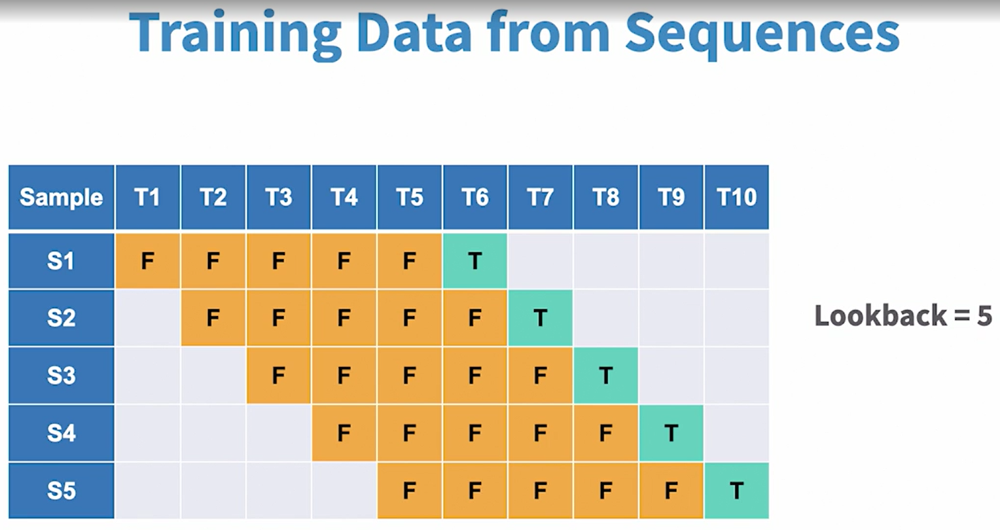

## Data preprocessing
Do note that given that there is only one feature variable here, scaling is optional.

For sequence model, we should not be splitting data randomly but we should split it sequentially.

## Preparing time series data with lookback
We will usually get a sequence as training data, and need to build a model to predict for the next day based on the previous days. 
Target = the value for the current time step
Features = values for the previous time steps

We first establish a `lookback value` which is the number of previous time steps that will be used as training data. 

We then create the first sample by taking the 6th value as a target value shown here as T, 
and the first five as feature values shown here as F.
Then the second sample will be created by sliding one step ahead.

## Create RNN model
Keras masks the complexities around hidden state processing, and makes it easy for us to build RNN models
