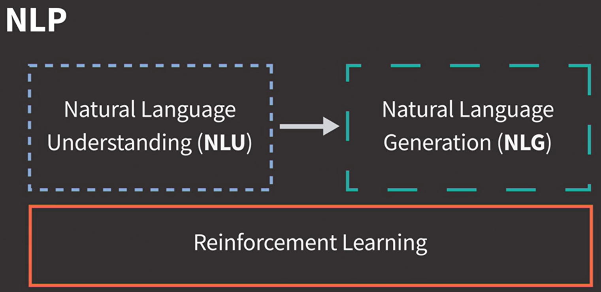

# Introduction to Conversational AI
https://www.linkedin.com/learning/introduction-to-conversational-ai

Software that uses computer algorithms to engage in a realistic and natural dialogue with humans.

precursors to modern conversational AI
- 1964 Eliza
- 1995 A.L.I.C.E
- 1997 Cleverbot
- 2007 - 2014: Siri, Google Assistant, Cortana

Automatic Speech Recognition (ASR)

Raw Text > Natural Language Processing(NLP)

3 components of Natural Language Processing (NLP)
- Reinforcement Learning
- Natural Language Generation (NLG)
- Natural Language Understanding (NLU)

A multi-turn dialogue means that a conversational AI uses the past context of the dialogue to hold a conversation even when old topics are brought up